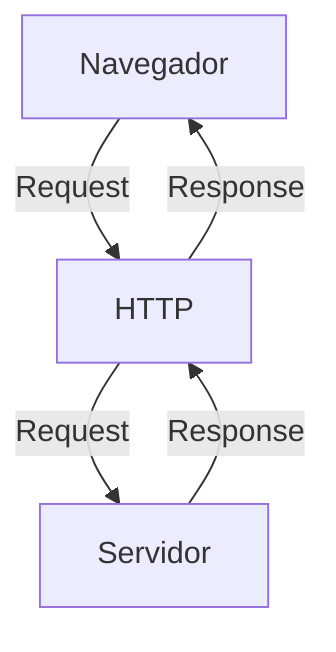
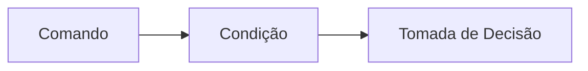
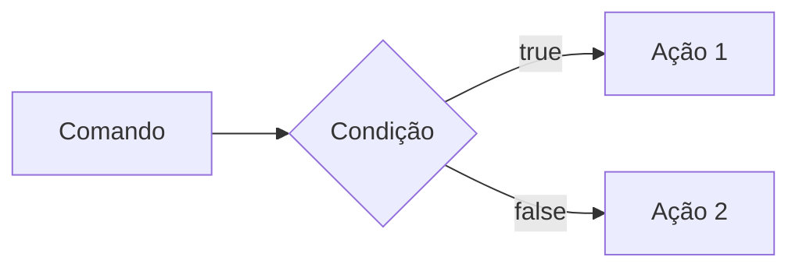
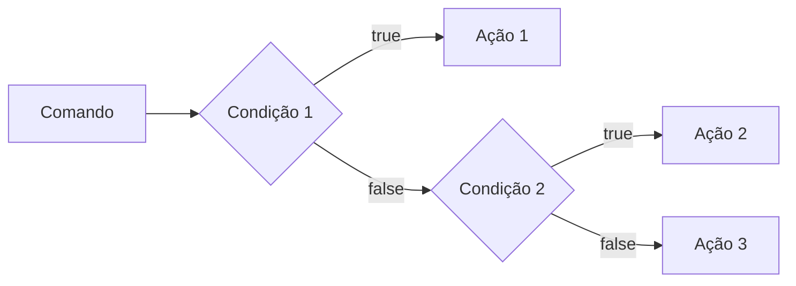
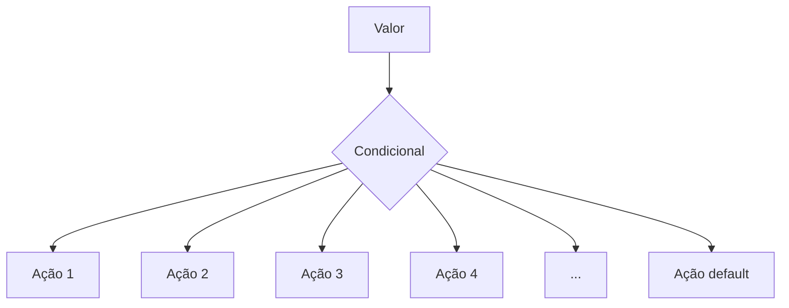
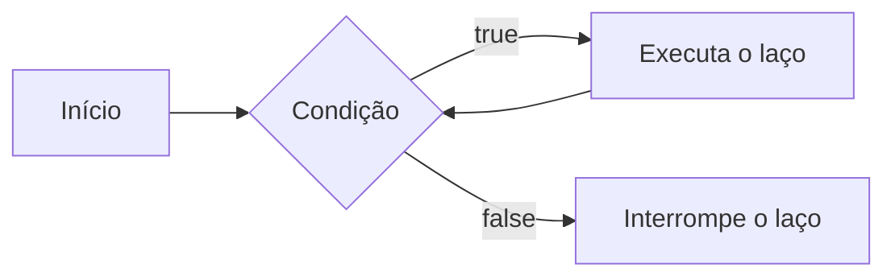

# Curso BackEnd - 1º Semestre - 105h

Prof. Diogo Barbosa

Escola SENAI Americana 

2º Semestre 2026

## Objetivos do curso

- Desenvolver aplicações web Server Side, utilizando a linguagem PHP.
- Aplicar Sintaxe nativa PHP Vanilla;
- Manipulação HTTP;
- Persistência de Dados (Armazenamento em BCD);
- Segurança contra SQL Injection/CSRF;
- Refatoração em POO (Programação Orientada Objetos);
- Arquitetura MVC;
- Utilização do Framework Laravel;

## Cronograma do Semestre 

Carga Horária: 105h

Duração: 20 Semanas

### Semana 1: Introdução ao BackEnd e Configuração do Ambiente PHP

#### O que é BackEnd?

O back-end é a parte de um site ou aplicativo que o usuário não vê, mas que faz tudo funcionar por trás das telas.

- Guarda e organiza informações em um banco de dados;
- Confere se o login e senha estão corretos;
- Calcula valores, como frete ou o total de uma compra;
- Garante que os dados de um usuário não apareçam para outro;
- Faz o sistema suportar muitas pessoas usando ao mesmo tempo, sem travar;

As principais linguagens utilizadas no desenvolvimento back-end são PHP, JavaScript/TypeScript, Python, Java, Kotlin, Go (Golang), C# e Rust.

O backend é o "cérebro" oculto de um site ou aplicativo. Ele roda em um servidor e cuida de tudo o que o usuário não vê na tela.

**As 3 partes básicas de todo backend:**

1. Servidor: o "computador" que fica ligado esperando pedidos (requisições);
2. Banco de dados: onde as informações ficam guardadas (usuários, produtos, mensagens, etc. );
3. Lógica de negócio: as regras do sistema (ex: não deixa comprar se não tiver estoque).

**O Mercado de Trabalho em Back-End:**

O desenvolvimento Back-End é uma das áreas mais cruciais da Tecnologia da Informação.

- Com a transformação digital acelerada, empresas de todos os portes e setores dependem de infraestruturas sólidas e seguras.

- Setores de Atuação: Bancos, hospitais, e-commerces, logística, indústrias, startups e órgãos públicos utilizam Back-End para suportar suas operações críticas.

- Fatores de Crescimento: O avanço da computação em nuvem, aplicativos móveis, Big Data e IA impulsiona continuamente a busca por profissionais da área.

- Modelos de Trabalho: Alta flexibilidade com vagas presenciais, híbridas e remotas (inclusive com oportunidades internacionais).

#### Ciclo de vida da Requisição HTTP

##### O que é HTTP

**HTTP**, ou seja Hypertext Transfer Protocol, é um protocolo de comunicação utilizado para transferência de informações na WWW (World Wide Web) e em outros sistemas de redes.

O HTTP é a base pra que o cliente e um servidor Web troquem informações. Ele permite a requisição e a resposta de recursos, como imagens, arquivos e as próprias páginas web, por meio de mensagens padrão (protocolo).

##### Como Funciona o HTTP

1. O cliente estabelece contato com o servidor, estabelecendo uma requisição HTTP;
2. Nessa requisição o cliente especifica o método pretendido (read-GET, create-POST, update-PUT/PATCH, delete-DELETE).
3. O servidor processa e responde com uma mensagem HTTP, com os recursos solicitados;



### Como funciona na prática o BackEnd

- **Ação do usuário**: Envia uma solicitação pela UI (Interface do Usuário).
Exemplo de UI: Tela do celular, Navegador de Internet, Alexa ...
- **Envio da requisição**: A UI transforma a ação do usuário em uma requisição HTTP
- **O processamento BackEnd**: o código BackEnd recebe o pedido, valida os dados e decide o que fazer (Ex: consulta uma informação no banco de dados)
- **Resposta**: O servidor devolve o resultado para a UI (Ex: um login autorizado, uma compra confirmada, ...)

#### Tipos de requisição HTTP

Os tipos de requisição HTTP indicam a ação que o usuário deseja executar no servidor. As principais ações são:

- **GET**: Pede dados de um lugar especifico. "Não faz alterações no servidor"
- **POST**: Envia dados novos para **criar** algo ou processar informações.
- **PUT/PATCH**: Modifica dados já existentes. **PUT** -> Atualização total dos dados. **PATCH** -> Atualização parcial dos dados.
- **DELETE**: Apaga um dado do servidor.
---

#### Iniciando o PHP

##### O que é PHP

**PHP** (Hypertext PreProcessor) é uma linguagem de programação interpretada e open source, focada no desenvolvimento de sistemas para web, pode ser usada junto com o HTML para criação de páginas web dinâmicas.

##### Instalando o PHP

- Fazer o download do PHP (php.net);
- ZIP - Non Thread Safe 8.5
- Descompactar o arquivo do PHP na pasta C:\src\php (Para descompactar, usar o 7Zip = Melhor) -> nunca salvar arquivos na raiz do sistena (C:)
- Modificar o arquivo php.ini-development para -> php.ini (cria as configurações do PHP na máquina) - adicionar ou remover funcionalidade do PHP
- Adicionar a pasta do PHP (C:\src\php) as variáveis de ambiente do sistema (PATH) 
- Verificar a instalação rodando o comando php --version

##### Contextualizando o PHP

O PHP de fato é uma das linguagens de programação mais populares da atualidade. Ela permite que você crie aplicações web robustas, de uma maneira muito simplificada e direto ao ponto. Sem contar que a linguagem traz diversos recursos que facilitam e aceleram o processo de desenvolvimento de sites e sistemas para web. E além do mais, ela ainda tem um ótimo ecossistema, uma excelente comunidade e um grande mercado de trabalho.

##### Criando minha primeira aplicação em PHP

Criando um Hello, World!!!

##### Criando o perfil de PHPVanilla

-> Profile -> New profile
-> Extensions:
- PHP IntelePhense (A do Elefantinho): AutoCompletar (Snippets)
- PHP Debug (Xdebug): Acha erros em linha de código
- PHP CS FIXER: Formatação padrão do código (Identação)
- PHP Server: Sobe um servidor local para acompanhamento em tempo real

##### Estudo de variáveis e constantes em PHP

Declarar variáveis é alocar um espaço na memória que permite a inclusão e manipulação de dados.

**Variáveis**

- Devem ser declaradas usando "$" antes do nome da variável
- Podem ser String, Numérica (Int e float), Booleanas e Nulas. Não permite declaração de Undefined
- São não tipadas (não precisa declarar o tipo na criação), a tipagem é atribuida ao adicionar o valor
- Usar o "declare(strict_types=1);" na primeira linha do arquivo => blindar o sistema contra conflitos de tipos de variáveis.

**Constantes**

- Não podem ser modificadas ou redeclaradas após a criação
- Pode ser criada usando "const" ou "define"
- Não permitem interpolação

---

### Semana 2 - Operadores em PHP (Aritméticos, Relacionais e Lógicos)

#### Estudo de operadores

**Aritméticos**: São usados para realizar calculos.

| Operador | Nome | Exemplo | Resultado |
|---|---|---|---|
| + | Adição | 10 + 5 | 15 |
| - | Subtração | 10 - 5 | 5 |
| * | Multiplicação | 10 * 5 | 50 |
| / | Divisão | 10 / 5 | 2 |
| % | Módulo (resto) | 10 % 3 | 1 (10 div por 3, da 3 e sobra 1) |
| ** | Expoente | 2 ** 3 | 8 (2 elevado a 3) |

#### Obs: O operador % é o melhor amigo de um programador, permite ordenar listas e organizar fila e pilhas.

**Relacionais**: São usados para comparar 2 ou mais valores, o resultado de uma operação relacional é sempre uma booleana (true, false).

| Operador | Nome | Exemplo | Resultado |
|---|---|---|---|
| == | Igual a | 10 == 10 | True |
| === | Igualdade Estrita (compara o valor e o tipo das variáveis) | "10" === 10 | False |
| != | Diferente de | 5 != 7 | True |
| !== | Diferença Estrita (compara o valor e o tipo também) | "10" !== 10 | True |
| > | Maior que | 8 > 24 | False |
| < | Menor que | 10 < 5 | False |
| >= | Maior ou igual que | 40 >= 36 | True |
| <= | Menor ou igual que | 30 <= 30 | True |

**Lógicos**: Permite a combinação entre sentenças.

- Operador AND (E) -> && : Para o resultado ser verdadeiro TODAS as combinações precisam ser verdadeiras
    - true && true -> true
    - false && false -> false

- Operador OR (OU) -> || : Para o resultado ser verdadeiro, basta APENAS UMA condição ser verdadeira
    - false || true -> true
    - false || false -> false

- Operador NOT (NÃO) -> ! : Inverte a lógica da sentença
    - !true -> false
    - !false -> true

### Semana 3 - Estrutra de Controle de Dados (Condicionais e Repetição)

- **Conteúdo**: Estruturas `if`, `else`, `elseif`, operadores ternários, `match` => substituto do `switch/case`, loops `for`, `while`, `do-while` e `foreach`


#### Estrutura de controle de Dados ajudam no processo de automatização em programas e sistemas 

##### Condicionais (IF, ELSE, ELSEIF)

- **Formas de Uso**:

Uso do `if` apenas
Exemplo: aplicar um desconto de 10% em compras acima de R$100



```php
if ($valorCompra > 100) {
    $desconto = $valorCompra * 0.9;
}
```

- Uso do `if` e do `else`
Exemplo: Aplicar um desconto de 10% para compras acima de R$100 e 5% para as demais compras



```php

if ($valorCompra > 100) {
    $valorFinal = $valorCompra * 0.9;
} else {
    $valorFinal = $valorCompra * 0.95;
}

```

- Uso do `elseif` (Encadeado)
Exemplo: Compras acima de R$200 tem 15% de desconto, acima de R$100 tem 10% de desconto e outras 5% de desconto


```php

    if($valorCompra > 200) {
        $valorFinal = $valorCompra * 0.85;
    } elseif($valorCompra > 100) {
        $valorFinal = $valorCompra * 0.9;
    } else {
        $valorFinal = $valorCompra * 0.95;
    }

```

### *OBS*: sempre usar `elseif` para situações que precisam de mais de uma condição, ou seja, fazer o encadeamento das condições.

- Uso **Errado** do if

Não fazer o encadeamento de condicionais

```php

if($valorCompra1 > 200) {
    $valorFinal = $valorCompra * 0.85;
}
if($valorCompra > 100) {
    $valorFinal = $valorCompra * 0.90;
}
if($valorCompra < 100) {
    $valorFinal = $valorCompra * 0.95;
}


```


##### Operadores Ternários
Um atalho para a estrutura condicional `if/else`, normalmente escrito em uma única linha de código.

`Condição ? verdadeira : falso`

Perfeito para decisões curtas de uma linha de comando
Exemplo: Verificar se a pessoa é maior de idade (18)

```php

$idade = 20;
// O formato é : (Condição) ? Verdadeiro : Falso

$status = ($idade >= 18) ? "Maior de idade" : "Menor de idade";
$status2 = ($idade < 18) ? "Criança" : ($idade < 60) ? "Adulto" : "Idoso";

```
##### Expressão Condicional `match` (PHP 8)

No mercado de PHP atual, não se usa mais uma dezena de `if/elseif` para checar valores fixos, e o antigo `switch/case` caiu em desuso. Agora usamos o `match`. Ele compara um valor e retorna diretamente o resultado.



```php

$diaSemana = date("Week") //Pega o dia da semana em formato númerico

//transformar o dia da semana em formato texto (Domingo, segunda, ...)

$nomeDiaSemana = match($diaSemana) {
    "0" -> "Domingo",
    "1" -> "Segunda",
    "2" -> "Terça",
    "3" -> "Quarta",
    "4" -> "Quinta",
    "5" -> "Sexta",
    "6" -> "Sábado",
    default -> "Dia inválido"
};

```
---

##### Laços de Repetição 

Um laço de repetição faz com que, um bloco de códigos rode várias vezes, até que uma condição mande parar.

- O laço `while` (Enquanto)

Ele verifica se a condição é verdadeira ANTES de entrar no laço. Ideal quando você não sabe quantas vezes vai rodar o laço.



Exemplo: Jogo de Adivinhação de um nº secreto

```php

$numeroSecreto = 7;
$tentativas = 0;

while($tentativas != $numeroSecreto) {
    echo "Tente novamente";
    // vou pegar um nº aleatório entre 1 a 10
    $tentativas = rand(1,10);
}

echo "Acertou miseravi!!!! o nº secreto é $numeroSecreto";

```

- O laço `do-while` (Faça enquanto) 

A diferença é que ele executa o bloco pelo menos uma vez, mesmo que a condição seja falsa desde o início, pois ele só pergunta no final.


Exemplo: Jogo de adivinhação

```php

$numeroSecreto = rand(1,10);

do {
    $tentativa = rand(1,10); // Simular um palpite aleatório
    
    if($tentativa == $numeroSecreto) {
        echo "Parabéns, acertou!!!";
    }

} while ($tentativa != $numeroSecreto);

```

Obs: Uso ideal do `do-while`, menus de sistema ou sistema de solicitações de dados, sistemas interativos;