# Curso BackEnd - 1º Semestre - 105h

Prof. Diogo Barbosa

Escola SENAI Americana 

2º Semestre 2026


## Objetivos do curso

- Desenvolver aplicações web Server Side, utilizando a linguagem PHP.
- Aplicar Sintaxe nativa PHP Vanilla;
- Manipulação HTTP;
- Persistência de Dados (Armazenamento em BCD);
- Segurança contra SQL Injection/CSRF;
- Refatoração em POO (Programação Orientada Objetos);
- Arquitetura MVC;
- Utilização do Framework Laravel;


## Cronograma do Semestre 

Carga Horária: 105h

Duração: 20 Semanas


### Semana 1: Introdução ao BackEnd e Configuração do Ambiente PHP


#### O que é BackEnd?

O back-end é a parte de um site ou aplicativo que o usuário não vê, mas que faz tudo funcionar por trás das telas.

- Guarda e organiza informações em um banco de dados;
- Confere se o login e senha estão corretos;
- Calcula valores, como frete ou o total de uma compra;
- Garante que os dados de um usuário não apareçam para outro;
- Faz o sistema suportar muitas pessoas usando ao mesmo tempo, sem travar;

As principais linguagens utilizadas no desenvolvimento back-end são PHP, JavaScript/TypeScript, Python, Java, Kotlin, Go (Golang), C# e Rust.

O backend é o "cérebro" oculto de um site ou aplicativo. Ele roda em um servidor e cuida de tudo o que o usuário não vê na tela.

**As 3 partes básicas de todo backend:**

1. Servidor: o "computador" que fica ligado esperando pedidos (requisições);
2. Banco de dados: onde as informações ficam guardadas (usuários, produtos, mensagens, etc. );
3. Lógica de negócio: as regras do sistema (ex: não deixa comprar se não tiver estoque).

**O Mercado de Trabalho em Back-End:**

O desenvolvimento Back-End é uma das áreas mais cruciais da Tecnologia da Informação.

- Com a transformação digital acelerada, empresas de todos os portes e setores dependem de infraestruturas sólidas e seguras.

- Setores de Atuação: Bancos, hospitais, e-commerces, logística, indústrias, startups e órgãos públicos utilizam Back-End para suportar suas operações críticas.

- Fatores de Crescimento: O avanço da computação em nuvem, aplicativos móveis, Big Data e IA impulsiona continuamente a busca por profissionais da área.

- Modelos de Trabalho: Alta flexibilidade com vagas presenciais, híbridas e remotas (inclusive com oportunidades internacionais).


#### Ciclo de vida da Requisição HTTP


##### O que é HTTP

**HTTP**, ou seja Hypertext Transfer Protocol, é um protocolo de comunicação utilizado para transferência de informações na WWW (World Wide Web) e em outros sistemas de redes.

O HTTP é a base pra que o cliente e um servidor Web troquem informações. Ele permite a requisição e a resposta de recursos, como imagens, arquivos e as próprias páginas web, por meio de mensagens padrão (protocolo).


##### Como Funciona o HTTP

1. O cliente estabelece contato com o servidor, estabelecendo uma requisição HTTP;
2. Nessa requisição o cliente especifica o método pretendido (read-GET, create-POST, update-PUT/PATCH, delete-DELETE).
3. O servidor processa e responde com uma mensagem HTTP, com os recursos solicitados;

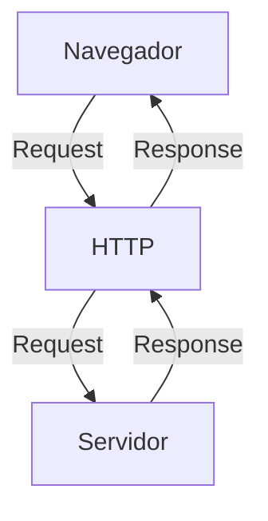


### Como funciona na prática o BackEnd

- **Ação do usuário**: Envia uma solicitação pela UI (Interface do Usuário).
Exemplo de UI: Tela do celular, Navegador de Internet, Alexa ...
- **Envio da requisição**: A UI transforma a ação do usuário em uma requisição HTTP
- **O processamento BackEnd**: o código BackEnd recebe o pedido, valida os dados e decide o que fazer (Ex: consulta uma informação no banco de dados)
- **Resposta**: O servidor devolve o resultado para a UI (Ex: um login autorizado, uma compra confirmada, ...)


#### Tipos de requisição HTTP

Os tipos de requisição HTTP indicam a ação que o usuário deseja executar no servidor. As principais ações são:

- **GET**: Pede dados de um lugar especifico. "Não faz alterações no servidor"
- **POST**: Envia dados novos para **criar** algo ou processar informações.
- **PUT/PATCH**: Modifica dados já existentes. **PUT** -> Atualização total dos dados. **PATCH** -> Atualização parcial dos dados.
- **DELETE**: Apaga um dado do servidor.

---


#### Iniciando o PHP


##### O que é PHP

**PHP** (Hypertext PreProcessor) é uma linguagem de programação interpretada e open source, focada no desenvolvimento de sistemas para web, pode ser usada junto com o HTML para criação de páginas web dinâmicas.


##### Instalando o PHP

- Fazer o download do PHP (php.net);
- ZIP - Non Thread Safe 8.5
- Descompactar o arquivo do PHP na pasta C:\src\php (Para descompactar, usar o 7Zip = Melhor) -> nunca salvar arquivos na raiz do sistena (C:)
- Modificar o arquivo php.ini-development para -> php.ini (cria as configurações do PHP na máquina) - adicionar ou remover funcionalidade do PHP
- Adicionar a pasta do PHP (C:\src\php) as variáveis de ambiente do sistema (PATH) 
- Verificar a instalação rodando o comando php --version


##### Contextualizando o PHP

O PHP de fato é uma das linguagens de programação mais populares da atualidade. Ela permite que você crie aplicações web robustas, de uma maneira muito simplificada e direto ao ponto. Sem contar que a linguagem traz diversos recursos que facilitam e aceleram o processo de desenvolvimento de sites e sistemas para web. E além do mais, ela ainda tem um ótimo ecossistema, uma excelente comunidade e um grande mercado de trabalho.


##### Criando minha primeira aplicação em PHP

Criando um Hello, World!!!


##### Criando o perfil de PHPVanilla

-> Profile -> New profile
-> Extensions:
- PHP IntelePhense (A do Elefantinho): AutoCompletar (Snippets)
- PHP Debug (Xdebug): Acha erros em linha de código
- PHP CS FIXER: Formatação padrão do código (Identação)
- PHP Server: Sobe um servidor local para acompanhamento em tempo real


##### Estudo de variáveis e constantes em PHP

Declarar variáveis é alocar um espaço na memória que permite a inclusão e manipulação de dados.

**Variáveis**

- Devem ser declaradas usando "$" antes do nome da variável
- Podem ser String, Numérica (Int e float), Booleanas e Nulas. Não permite declaração de Undefined
- São não tipadas (não precisa declarar o tipo na criação), a tipagem é atribuida ao adicionar o valor
- Usar o "declare(strict_types=1);" na primeira linha do arquivo => blindar o sistema contra conflitos de tipos de variáveis.

**Constantes**

- Não podem ser modificadas ou redeclaradas após a criação
- Pode ser criada usando "const" ou "define"
- Não permitem interpolação

---


### Semana 2 - Operadores em PHP (Aritméticos, Relacionais e Lógicos)


#### Estudo de operadores

**Aritméticos**: São usados para realizar calculos.

| Operador | Nome | Exemplo | Resultado |
|---|---|---|---|
| + | Adição | 10 + 5 | 15 |
| - | Subtração | 10 - 5 | 5 |
| * | Multiplicação | 10 * 5 | 50 |
| / | Divisão | 10 / 5 | 2 |
| % | Módulo (resto) | 10 % 3 | 1 (10 div por 3, da 3 e sobra 1) |
| ** | Expoente | 2 ** 3 | 8 (2 elevado a 3) |


#### Obs: O operador % é o melhor amigo de um programador, permite ordenar listas e organizar fila e pilhas.

**Relacionais**: São usados para comparar 2 ou mais valores, o resultado de uma operação relacional é sempre uma booleana (true, false).

| Operador | Nome | Exemplo | Resultado |
|---|---|---|---|
| == | Igual a | 10 == 10 | True |
| === | Igualdade Estrita (compara o valor e o tipo das variáveis) | "10" === 10 | False |
| != | Diferente de | 5 != 7 | True |
| !== | Diferença Estrita (compara o valor e o tipo também) | "10" !== 10 | True |
| > | Maior que | 8 > 24 | False |
| < | Menor que | 10 < 5 | False |
| >= | Maior ou igual que | 40 >= 36 | True |
| <= | Menor ou igual que | 30 <= 30 | True |

**Lógicos**: Permite a combinação entre sentenças.

- Operador AND (E) -> && : Para o resultado ser verdadeiro TODAS as combinações precisam ser verdadeiras
    - true && true -> true
    - false && false -> false

- Operador OR (OU) -> || : Para o resultado ser verdadeiro, basta APENAS UMA condição ser verdadeira
    - false || true -> true
    - false || false -> false

- Operador NOT (NÃO) -> ! : Inverte a lógica da sentença
    - !true -> false
    - !false -> true


### Semana 3 - Estrutra de Controle de Dados (Condicionais e Repetição)

- **Conteúdo**: Estruturas `if`, `else`, `elseif`, operadores ternários, `match` => substituto do `switch/case`, loops `for`, `while`, `do-while` e `foreach`


#### Estrutura de controle de Dados ajudam no processo de automatização em programas e sistemas 


##### Condicionais (IF, ELSE, ELSEIF)

- **Formas de Uso**:

Uso do `if` apenas
Exemplo: aplicar um desconto de 10% em compras acima de R$100

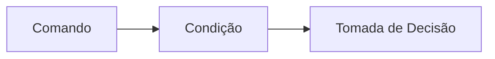

```php
if ($valorCompra > 100) {
    $desconto = $valorCompra * 0.9;
}
```

- Uso do `if` e do `else`
Exemplo: Aplicar um desconto de 10% para compras acima de R$100 e 5% para as demais compras

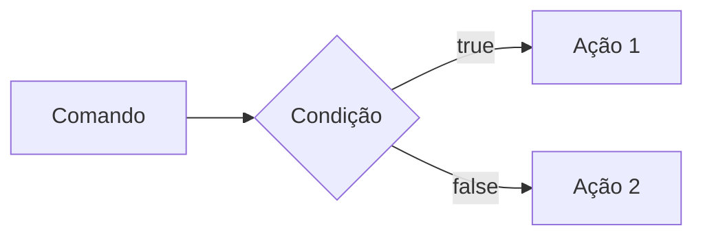

```php

if ($valorCompra > 100) {
    $valorFinal = $valorCompra * 0.9;
} else {
    $valorFinal = $valorCompra * 0.95;
}

```

- Uso do `elseif` (Encadeado)
Exemplo: Compras acima de R$200 tem 15% de desconto, acima de R$100 tem 10% de desconto e outras 5% de desconto

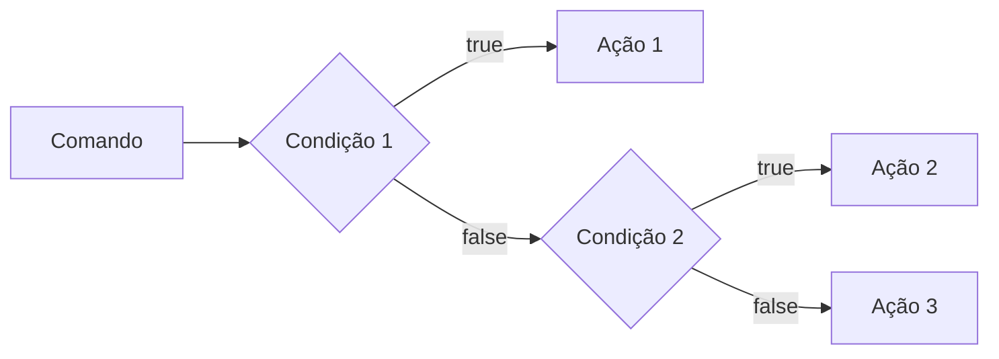
```php

    if($valorCompra > 200) {
        $valorFinal = $valorCompra * 0.85;
    } elseif($valorCompra > 100) {
        $valorFinal = $valorCompra * 0.9;
    } else {
        $valorFinal = $valorCompra * 0.95;
    }

```


### *OBS*: sempre usar `elseif` para situações que precisam de mais de uma condição, ou seja, fazer o encadeamento das condições.

- Uso **Errado** do if

Não fazer o encadeamento de condicionais

```php

if($valorCompra1 > 200) {
    $valorFinal = $valorCompra * 0.85;
}
if($valorCompra > 100) {
    $valorFinal = $valorCompra * 0.90;
}
if($valorCompra < 100) {
    $valorFinal = $valorCompra * 0.95;
}


```


##### Operadores Ternários

Um atalho para a estrutura condicional `if/else`, normalmente escrito em uma única linha de código.

`Condição ? verdadeira : falso`

Perfeito para decisões curtas de uma linha de comando
Exemplo: Verificar se a pessoa é maior de idade (18)

```php

$idade = 20;
// O formato é : (Condição) ? Verdadeiro : Falso

$status = ($idade >= 18) ? "Maior de idade" : "Menor de idade";
$status2 = ($idade < 18) ? "Criança" : ($idade < 60) ? "Adulto" : "Idoso";

```


##### Expressão Condicional `match` (PHP 8)

No mercado de PHP atual, não se usa mais uma dezena de `if/elseif` para checar valores fixos, e o antigo `switch/case` caiu em desuso. Agora usamos o `match`. Ele compara um valor e retorna diretamente o resultado.

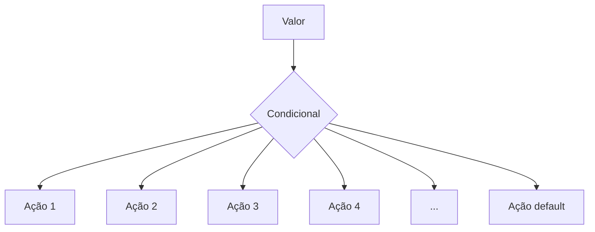

```php

$diaSemana = date("Week") //Pega o dia da semana em formato númerico

//transformar o dia da semana em formato texto (Domingo, segunda, ...)

$nomeDiaSemana = match($diaSemana) {
    "0" -> "Domingo",
    "1" -> "Segunda",
    "2" -> "Terça",
    "3" -> "Quarta",
    "4" -> "Quinta",
    "5" -> "Sexta",
    "6" -> "Sábado",
    default -> "Dia inválido"
};

```


---


##### Laços de Repetição 

Um laço de repetição faz com que, um bloco de códigos rode várias vezes, até que uma condição mande parar.

- O laço `while` (Enquanto)

Ele verifica se a condição é verdadeira ANTES de entrar no laço. Ideal quando você não sabe quantas vezes vai rodar o laço.

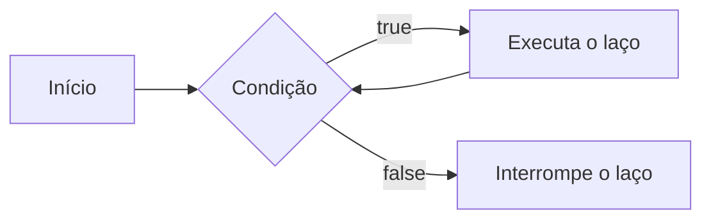

Exemplo: Jogo de Adivinhação de um nº secreto

```php

$numeroSecreto = 7;
$tentativas = 0;

while($tentativas != $numeroSecreto) {
    echo "Tente novamente";
    // vou pegar um nº aleatório entre 1 a 10
    $tentativas = rand(1,10);
}

echo "Acertou miseravi!!!! o nº secreto é $numeroSecreto";

```

- O laço `do-while` (Faça enquanto) 

A diferença é que ele executa o bloco pelo menos uma vez, mesmo que a condição seja falsa desde o início, pois ele só pergunta no final.

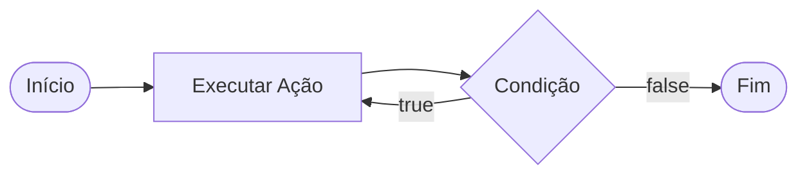

Exemplo: Jogo de adivinhação

```php

$numeroSecreto = rand(1,10);

do {
    $tentativa = rand(1,10); // Simular um palpite aleatório
    
    if($tentativa == $numeroSecreto) {
        echo "Parabéns, acertou!!!";
    }

} while ($tentativa != $numeroSecreto);

```

Obs: Uso ideal do `do-while`, menus de sistema ou sistema de solicitações de dados, sistemas interativos;


---


##### Laço de Repetição `for`

Use o `for` quando você sabe quantas vezes precisa repetir uma ação ou quando precisa controlar um contador. Ele possui 3 partes:

- Inicialização;
- Condição;
- Incremento;

Sintaxe:

for(inicialização; condição; incremento){
    Ação
}

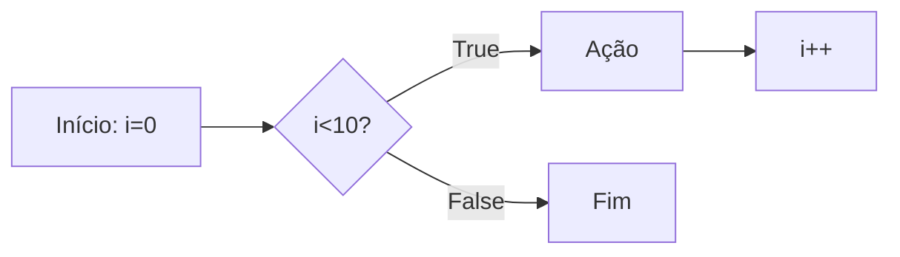

Exemplo de aplicação: Exibir todos os meses do ano

```php
for($mes=1; mes<=12; $mes++) {
    echo "Mês $mes";
}
```

Nesse exemplo, `$mes` começa em 1, o laço continua enquanto `$mes` for menor ou igual a 12 e, ao final de cada repetição, `$mes` o contador aumenta em 1


##### Laço de Repetição `foreach`

Use o `foreach` quando precisar percorrer cada item de um **array**. Ele acessa os elementos diretamente sem que você precise controlar o contador.

Exemplo: Imprimir todos os itens de um vetor.

```php
$frutas = ["Maça", "Banana", "Uva", "Laranja"];

foreach($frutas as $fruta) {
    echo "Fruta: $fruta";
}
```

Outro exemplo: Acessar a chave e o valor de cada item:

```php
$precos = [
    "Caderno" => 25.00,
    "Caneta" => 5.50,
    "Mochila" => 99.00,
]; // vetor não ordenado do tipo chave(key) => Valor(Value) ===> Coleção/Dicionário

//percorrer o vetor usando o laço Foreach
foreach($precos as $produto => $preco) {
    echo "$produto: R$" . number_format($preco,2);
}
//acessa a chave e o valor de cada item do vetor

```

---
---

#### Desafio: Simulador de cobrança (FINANSENAI)


#### Desafio Final


---

---


### Semana 4 - Modularização com Funções


#### Principio do DRY (Don´t Repeat Yourself)

Se uma lógica foi escrita duas ou mais vezes dentro de um código, essa lógica deve virar uma função.


#### Funções Nativas do PHP

O PHP tem milhares de funções prontas, essa função já criada é chamada de função nativa.

- **O que é uma função?**

Uma função é como uma máquina: você coloca a matéria prima(Parâmetro), ela processaa e devolve um produto final (Retorno)

Exemplo de função nativa

```php
$texto = "senai americana";

// Usar uma função nativa para substituição de parte do texto => str_replace
$textoNovo = str_replace("americana", "são paulo", $texto);
// "senai são paulo"

// Usar uma função nativa para substituição das letras minúsculas por letras maiúsculas => strtoupper
echo strtoupper($textoNovo); // SENAI SÃO PAULO
```


##### Principais funções nativas (Mais Utilizadas)

As funções abaixo já fazem parte do PHP e podem ser chamadas diretamente no código. Observe os parâmetros que cada uma recebe e o tipo de informação que ela retorna.

| Função | Categoria | O que faz | Como usar |
|---|---|---|---|
| `strlen()` | Strings | Retorna a quantidade de caracteres de um texto. | `$tamanho = strlen($texto);` |
| `strtoupper()` | Strings | Converte o texto para letras maiúsculas. | `$resultado = strtoupper($texto);` |
| `strtolower()` | Strings | Converte o texto para letras minúsculas. | `$resultado = strtolower($texto);` |
| `ucfirst()` | Strings | Converte a primeira letra do texto para maiúscula. | `$resultado = ucfirst($texto);` |
| `trim()` | Strings | Remove espaços e quebras de linha no início e no fim do texto. | `$limpo = trim($texto);` |
| `str_replace()` | Strings | Substitui uma parte do texto por outra. | `$novo = str_replace("-", "", $cpf);` |
| `substr()` | Strings | Extrai uma parte do texto a partir de uma posição. | `$inicio = substr($texto, 0, 3);` |
| `explode()` | Strings | Divide um texto e cria um array usando um separador. | `$palavras = explode(" ", $nome);` |
| `implode()` | Arrays | Junta os itens de um array em um único texto. | `$lista = implode(", ", $nomes);` |
| `count()` | Arrays | Conta a quantidade de itens de um array. | `$total = count($produtos);` |
| `in_array()` | Arrays | Verifica se um valor existe dentro de um array. | `$existe = in_array("SP", $estados, true);` |
| `array_push()` | Arrays | Adiciona um ou mais itens ao final de um array. | `array_push($nomes, "Ana");` |
| `array_pop()` | Arrays | Remove e retorna o último item de um array. | `$ultimo = array_pop($nomes);` |
| `sort()` | Arrays | Ordena um array em ordem crescente e reorganiza suas chaves. | `sort($notas);` |
| `array_keys()` | Arrays | Retorna um array contendo as chaves de outro array. | `$chaves = array_keys($produtos);` |
| `number_format()` | Números | Formata um número com casas decimais e separadores definidos. | `$preco = number_format($valor, 2, ',', '.');` |
| `round()` | Números | Arredonda um número para a quantidade de casas informada. | `$media = round($nota, 2);` |
| `max()` | Números | Retorna o maior valor de uma lista ou array. | `$maior = max($notas);` |
| `min()` | Números | Retorna o menor valor de uma lista ou array. | `$menor = min($notas);` |
| `is_numeric()` | Validação | Verifica se o valor é um número ou uma string numérica. | `if (is_numeric($entrada)) { ... }` |
| `isset()` | Validação | Verifica se uma variável existe e não possui valor `null`. | `if (isset($usuario)) { ... }` |
| `empty()` | Validação | Verifica se uma variável está vazia. | `if (empty($pedido)) { ... }` |
| `date()` | Data e hora | Formata uma data ou hora conforme uma máscara. | `$hoje = date('d/m/Y');` |
| `file_exists()` | Arquivos | Verifica se um arquivo ou diretório existe. | `if (file_exists('dados.txt')) { ... }` |
| `file_get_contents()` | Arquivos | Lê todo o conteúdo de um arquivo ou endereço. | `$conteudo = file_get_contents('dados.txt');` |
| `file_put_contents()` | Arquivos | Grava conteúdo em um arquivo, criando-o se necessário. | `file_put_contents('log.txt', $mensagem);` |

**Atenção:** algumas funções modificam o array original, como `sort()`, `array_push()` e `array_pop()`. Já outras retornam um novo valor, como `count()`, `explode()` e `str_replace()`. Em caso de dúvida, consulte a documentação oficial do PHP e verifique o retorno da função.


##### Documentação PHP

[Acesse a documentação oficial do PHP em português](https://www.php.net/manual/pt_BR/)

Consulte também a [referência de funções do PHP](https://www.php.net/manual/pt_BR/funcref.php) para pesquisar a sintaxe, os parâmetros e os valores para cada função.


#### Funções Customizadas (Criando suas próprias máquinas)

Quando o PHP não tem a função que queremos, nós a criamos!

**A regra de ouro**: Uma função deve focar em `return` (retornar um valor), e não imprimir (`echo`).

Veja a diferença nesse exemplo:

```php
function calcularTotal($preco, $quantidade) {
    // A função calcula e retorna o resultado, mas não imprime nada
    return $preco * $quantidade;
}

$total = calcularTotal(25.00,3);

// Imprimir é feito fora da função
echo "Total da compra: R$ " . round($total,2);
// Total da compra: R$ 75.00
```

A função `calcularTotal()` pode ser reutilizada em uma página, relatório ou teste. O `echo` aparece somente fora da função, no momento de apresentar o resultado para o usuário


##### Padrão de uso corporativo (PHP 8 Strict Types)

No mercado de trabalho exigimos que a unção avise exatamente o **TIPO** de dado que ela espera receber e o **TIPO** de dado que ela vai devolver.

Isso é chamado de **tipagem de funções**. Ao declarar os tipos, o código fica mais fácil de entender e o PHP consegue identificar alguns erros antes que eles causem problemas maiores no sistema.

Os tipos mais usados:

* `int`: número inteiro, `10` ou `1024`;
* `float`: número decimal ou ponto flutuante, `10.90`;
* `string`: texto, como `"Maria"`;
* `bool`: valor lógico, `true` ou `false`;
* `noid`: identifica que a função não devolve nenhum valor;

O tipo deve ser escrito antes do nome de cada parâmetro e o tipo da função deve ser escrito após os parênteses, precedido do ":" informando o que a função vai devolver

Exemplo de uso na função e parâmetros tipados:

```php
function apresentarProduto(string $nome, float $preço): string{
    return "$nome custa R$ $preço";
}

$mensagem = $apresentarProduto("Caderno", 25.00);
echo $mensagem;
// Caderno custa R$ 25.00
```

> **Resumo**: Os tipos dos parâmetros documentam as entradas da função, o tipo após `:` documenta a saída da função.

##### O tipo mágico : `VOID`

Se uma função faz um trabalho interno e **não retorna NADA**, dizemos que o retorno dela é "vazio" (`void`).

Exemplo de função sem retorno:

```php
function registraLog(string $mensagem): void{
    // Apenas salva em um arquivo de texto, não devolve nenhuma váriavel
    file_put_contents("erro.log", $mensagem);
}
```


#### Escopo e Referência (O segredo da memória)


##### O que é Escopo? (A regra de Las Vegas)


*O que acontece dentro da função, fica dentro da função*.
Uma variável criada fora não existe lá dentro, e uma criada lá dentro morre quando a função acaba.

**Escopo** é o local do programa onde a variável pode ser armazenada/acessada. Em PHP, uma variável criada fora de uma função pertence ao *escopo global*, uma variável criada dentro de uma função pertence ao *escopo local*.

Exemplo de Escopo de variável:

```php
$nomeSistema = "CRM SENAI"; //Variável Global

function criarMensagem(string $nome): string {
    $mensagem = "Bem-Vindo!!!";
    return $mensagem . $nome
}

echo $nomeSistema // Correto: está no escopo global
echo $mensagem; // Errado: $mensagem só existe dentro da função, não é acessada fora
echo criarMensagem("Nome do Fulano"); // Correto: A função devolve sua variável local
// CRM SENAI
// Bem-Vindo! Nome do Fulano
```

**Como enviar dados para uma função?**

A forma mais segura e organizada é enviar os dados por **Parâmetros**. Assim, a função não precisa acessar diretamente variáveis globais:

```php

function saudar(string $nome): string{
    return "Olá, $nome!";
}

$nomeCliente = "João";
echo saudar($nomeCliente); // Olá, João!
```

Nesse caso, `$nomeCliente` continua no escopo global, mas seu valor é enviado para o parâmetro local `$nome`. A função recebe uma informação, processa e retorna o resultado

**Exemplo Incorreto:**

```php
$nome = "João"; // Váriavel global

function saudar() : string{
    return "Olá, $nome"; // Errado: a função não reconhece a variável global
}
```

A função `saudar()` não conhece a variável global `$nome`. Ocasionando um erro no sistema.

> **Resumo**: váriaveis protegem os dados internos da função; parâmetros são o caminho recomendado para evutar erros e enviar informações, e `return` é usado para devolver um resultado ao código que chamou a função.


--- 


### Semana 5 - Arrays e manipulação avançada de dados

Um array (também conhecido como vetor), é uma estrutura de dados usada para armazenar vários valores em uma única váriavel.

**Tipos de arrays em PHP**:

- Indexados/Ordenados (númericos): Usam números inteiros como índices (chaves), que começam em zero por padrão;
- Associativos/Não ordenados (strings): Usam chaves (strings) para identificar valores;
- Multidimensionais: Contêm um ou mais arrays dentro de outros arrays.

**Exemplo de arrays:**

```php
// Array indexado
$frutas = ["maça", "banana", "laranja"];

// Array associativo
$capitais = [
    "SP" => "São Paulo",
    "MG" => "Minas Gerais",
    "RJ" => "Rio de Janeiro",
    "ES" => "Vitória",
]

// Acessando dados
echo $fruta[0]; // => "Maça"
echo $capitais["SP"]; // => "São Paulo"

```

> OBS: Em arrays associativos, nos trocamoss os nº dos índices por nomes (Chaves/Keys). A setinha => significa "recebe" 

**Arrays Multidimensionais (Banco de Dados na memória)**

É aqui que o "BackEnd" começa de verdade. O array multidimensional é o formato como os Banco de Dados chegam como resposta as solicitações feitas pela API.

**Exemplo de aplicação de array multidimensional:**

```php

$clientes = [
    ["id" => 1, "nome" => "Ana", "email" => "ana@email.com", "ativo" => true],
    ["id" => 2, "nome" => "Bruno", "email" => "bruno@gmail.com", "ativo" => false],
    ["id" => 3, "nome" => "Carlos", "email" => "carlos@hotmail.com", "ativo" => true]
];

// Como acessar o email do Bruno
echo $clientes[1]["email"]; // => bruno@gmail.com

```

#### O melhor amigo dos Arrays: `Foreach`

O laço de repetição especial para arrays. O `foreach` percorre cada elemento de um array.

**Exemplo de aplicação:**

```php
foreach($clientes as $clienteAtual) {
    echo $clienteAtual["nome"];
    echo $clienteAtual["email"];
}
// Vai imprimir nome e email de todos os clientes do array

```

#### Transformações de Arrays (Arrow Function)

São usadas em filtragem e mapeamento de dados de um array.

- `array_filter`
Serve para buscar dados e devolve apenas os dados que passarem pelo filtro.

**Exemplo de aplicação:**

```php
$clientesAtivos = array_filter($clientes, fn($c) => $c["ativo"] == true);

// Novo array, tera apenas os clientes que ativo for igual a true
```

- `array_map`
Serve para alterar todos os dados de uma lista de uma única vez

**Exemplo de aplicação:**

```php
$produtos = [
    ["id"=>1, "preco"=10.00, "setor"=>"jardim"],
    ["id"=>2, "preco"=15.90, "setor"=>"ferramentas"],
    ["id"=>3, "preco"=20.00, "setor"=>"jardim"]
];

// Ajuste de preço em 10%
$produtosAjustados = array_map(fn($p) => $p[preco] = $p[preco] * 1.1, $produtos);
```

#### Debugando um array (Kit primeiro socorros)

- `print_r`
função usada para exibir informações sobre váriaveis de forma legível em linguagem natural

```php
print_r($frutas);

// Array
(
    [0] => "maça",
    [1] => "banana",
    [2] => "laranja",
)
```

- `var_dump`
Exibe com mais detalhes as informações de um array ou variável em PHP

```php
echo var_dump($frutas);
// Mostra tudo: tipo de dados, tamanho e o valor
```
---

### Semana 6 - Processamentos HTTP e Formulários WEB


#### Anatomia de um formulário HTML para BackEnd


Antes do PHP processar qualquer informação, precisamos coletar informações no FrontEnd através de um `<form>` 

**Exemplo de `<form>` HTML**

```html
<form action="processa.php" method="POST">
    <label>Nome Completo</label>
    <input type="text" id="campoNome" name="nomeUsuario" placeholder="Digite seu nome">
    <button type="submit">Cadastrar</button>
</form>
```


**Os 3 pilares do formulário**
1. action="processa.php" -> O destino: Define qual script PHP no servidor receberá os dados.
2. method="POST" -> O transporte: Define a via de protocolo HTTP usada (GET ou POST).
3. name="nomeUsuarios" -> A etiqueta do dado: É o nome da chave que o PHP usará no array associativo ($POST["nomeUsuario"]).

> OBS: Nunca confundir `id` com `name` no input, o PHP ignora o `id`

#### O protocolo HTTP


Quando o usuário clica no botão `type="submit"`, o navegador compila todas as informações dos campos preenchidos e dispara um pacote de comunicação padronizado pelo **Protocolo HTTP(Hypertext Transfer Protocol)**

**O formato de transferência**

- **Método GET**: Solicitar informações públicas e realizar buscas, mas altamente arriscada para dados privados.

- **Método POST**: As informações viajam guardads dentro do protocolo

#### Testar o uso dos Protocolos HTTP

OK

#### GET vs POST

1. O Método GET (consultas e filtros)

O método `GET` é utilizado quando a intenção do cliente é **buscar ou filtrar dados** sem alterar o estado do servidor. Os dados enviados via `GET`são anexados diretamente ao final da URL na forma de uma **QueryString** 

2. O método `POST` (envio de cargas úteis e mutações)

O método `POST` é utilizado quando o formulário envia dados que devem ser processados para **criar ou modificar registros** no sistema (ex: cadastro de usuários, finalizações de compras, upload de arquivos)

#### Como os métodos funcionam no PHP (`$_GET`, `$_POST`, `$_SERVER`) - As SuperGlobais

As variáveis superglobais são arrays internos pré-definidos que estão sempre acessíveis em qualquer parte do script php, sem precisar ser declaradas.

- **$_GET**: Armazena dados passados pela URL via parâmetros de consulta (query string).
- **$_POST**: Recolhe dados enviados por formulários usando método HTTP POST.
- **$_SERVER**: Contém informações sobre o servidor, ambiente e caminhos de script.

**Porque usamos `??` para obter dados da superglobal??**

Usamos o operador de nulidade (coalescência nula) para verificar se o valor da variável não é `null`, se caso for `null` atribuimos um valor para evitar erros no script.

**Exemplo de uso**: 

Na primeira vez que uma página é aberta, o formulário ainda não foi enviado. Portanto, a chave pode não existir no array

```php
$nome = $_POST["nome"];
// Se escrever desta forma, o códio pode gerar um aviso de erro.

// A forma correta de escrita é
$nome = $_POST["nome"] ?? "";
// Se $_POST["nome"] não existir, use uma string vazia.

// Outra forma de verificar nulidade é usando if/else
if(isset($_POST["nome"])) {
    $nome = $_POST["nome"];
} else {
    $nome = "";
}
```

#### Validação de dados no BackEnd é obrigatória

Muitos desenvolvedores iniciantes acreditam que colocar atributos como `required`, `type="email"` ou `min=0` na <tag> do HTML é suficiente para proteger o sistema. **Isso é ilusão**. Sempre devemos fazer validações de dados no código BackEnd. As validações no BackEnd devem acontecer sempre antes do processamento de qualquer dado recebido pelo usuário.

### Funções nativas essenciais para limpeza e validação de dados

| Função | Descrição | Quando usar | Exemplo simples |
| :--- | :--- | :--- | :--- |
| `trim($valor)` | Remove espaços no início e no fim da string | Limpar texto digitado pelo usuário | `$nome = trim($_POST['nome'] ?? '');` |
| `htmlspecialchars($valor, ENT_QUOTES, 'UTF-8')` | Converte caracteres especiais em entidades HTML seguras | Exibir dados na tela sem risco de XSS | `echo htmlspecialchars($_POST['nome'] ?? '', ENT_QUOTES, 'UTF-8');` |
| `filter_var($valor, FILTER_VALIDATE_EMAIL)` | Valida formato de e-mail | Campos de e-mail | `filter_var($email, FILTER_VALIDATE_EMAIL)` |
| `filter_var($valor, FILTER_VALIDATE_INT)` | Verifica se o valor é inteiro válido | Idade, código, quantidade | `filter_var($_POST['idade'] ?? '', FILTER_VALIDATE_INT)` |
| `filter_var($valor, FILTER_VALIDATE_FLOAT)` | Verifica se o valor é número decimal válido | Preço, peso, altura, salário | `filter_var($_POST['preco'] ?? '', FILTER_VALIDATE_FLOAT)` |
| `isset($variavel)` | Verifica se uma variável existe e não é `null` | Garantir que o campo foi enviado | `if (isset($_POST['nome'])) { ... }` |
| `empty($valor)` | Verifica se o valor está vazio | Campos obrigatórios | `if (empty($_POST['senha'])) { ... }` |
| `strlen($valor)` | Retorna o tamanho da string | Exigir mínimo ou máximo de caracteres | `if (strlen($senha) < 6) { ... }` |
| `in_array($valor, $lista, true)` | Verifica se o valor pertence a uma lista permitida | `select`, `radio`, opções válidas | `in_array($categoria, ['A','B','C'], true)` |
| `is_numeric($valor)` | Confirma se o valor é numérico | Validação de número | `if (is_numeric($_POST['quantidade'])) { ... }` |
| `preg_match($padrao, $valor)` | Valida por expressão regular | CPF, CEP, telefone, senha forte | `preg_match('/^\d{5}-\d{3}$/', $cep)` |
| `filter_input(INPUT_POST, 'campo', FILTER_SANITIZE_SPECIAL_CHARS)` | Captura e limpa dados da requisição | Ler entradas com segurança | `$nome = filter_input(INPUT_POST, 'nome', FILTER_SANITIZE_SPECIAL_CHARS);` |

>OBS: Use `htmlspecialchars()` ao exibir valor em HTML => converte caracteres especiais em entidades correspondentees em HTML, evitando que o código seja interpretado erradamente pelo navegador. É usado principalmente na segurança WEB, para evitar ataques Cross-Site-Scriptinf(XSS). 

#### Preservação de estado em formulários (*Stick Form*)

A técnica do **Sticky Form** consiste em imprimir de volta o valor no atributo "value" do input, os dados que o usuário acaba de digitar, os valores são devolvidos aos inputs caso, ocorra algum erro de validação de dados no envio.

**Exemplo de uso**:

```php
<div class="campo">
    <label for="nome">Nome Completo</label>
    <input type="text" id="nome" name="nome" 
        value="<?= htmlspecialchars($dadosFormulario['nome'] ?? '') ?>"
        class="<?= isset($erro['nome']) ? 'input-erro' : '' ?>">
    <?php if (isset($erro["nome"])): ?>
        <span class="erro-texto"><?= $erro["nome"] ?></span>
    <?php endif; ?>
</div>
```

---

### Semana 7 - Segurança no BackEnd - Sanitização, Validação e Proteção contra XSS

**1º Mandamento do desenvolvedor BackEnd**

> Nunca confie no usuário: Toda entrada de dados vinda de fora do servidor é potencialmente maliciosa até que seja rigorosamente validada, sanitizada e codificada.

Quando você disponibiliza um campo de texto em um site, qualquer pessoa conectada a internet pode digitar códigos maliciosos em vez de textos. Se o código BackEnd pega esse texto diretamente sem nenhum tratamento, a ordem de execução de código abrirá portas para a invasão devastadora do sistema.

**A anatomia de um ataque: O que é o Cross-Site Scripting (XSS)**

O XSS ocorre quando uma aplicação web inclui dados não confiáveis em uma página web sem a devida validação ou escape de caracteres. Isso permite que um atacante execute scripts maliciosos (geralmente em JavaScript) diretamente no navegador de outro usuário que visitam o site.

**As principais modalidades de ataques:**

1. *Roubo de Sessão (Cookies Stealing)*: O JavaScript injetado lê os cookies de autenticação da vítima (document.cookie) e os envia para o servidor do atacante, permitindo que ele faça login na conta da vítima sem precisar da senha.

2. *Desconfiguração do Site (Defacement)*: Alteração visual do site, inserindo mensagens falsas, banners ofensivos ou formulários de login fraudulentos (phishing interno).

3. *Redirecionamento Maliciso*: Força o navegador da vítima a abrir sites com vírus ou páginas clonadas de banco.

4. *Captura de Teclas (KeyLogger)*: Grava tudo que a vítima digita enquanto a página estiver aberta.

**Os vetores de ataques mais frequentes**:

Nem todo ataque XSS usa a tag óbvia `<script>`. Desenvolvedores que tentam bloquear XSS apenas "apagando a palavra script" são facilmente burlados por atacantes:

| Vetor de Injeção | Como funciona o ataque? |
| :--- | :--- |
| `<script>alert('XSS')</script>` | Injeção direta de bloco de script executável pelo navegador. |
| `` | O navegador tenta carregar a imagem inexistente e dispara o evento `onerror` com o JavaScript. |
| `<svg onload="alert('XSS')">` | O navegador renderiza o elemento gráfico SVG e executa o evento `onload`. |
| `<a href="javascript:alert('XSS')">Clique</a>` | O clique no link executa a pseudo-URL com JavaScript em vez de abrir um site. |
| `"><script>alert('XSS')</script>` | Usado quando o dado é impresso dentro de um `<input value="...">`, quebrando o atributo e injetando a tag. |

#### **A tríade de defesa: Validação, Sanitização e Escapamento**

1. **Validação**: Verifica se o dado recebido atende aos requisitos exatos do sistema (tipo, tamanho, formato).

Ex: Verificar se o e-mail possui `@` e dominio válido (`filter_var($email, FILTER_VALIDATE_EMAIL)`).

2. **Sanitização**: Transforma o dado para adequa-lo ao formato desejado, removendo caracteres indesejados.

Ex: Remover espaços no início e fim (`trim($nome)`).

3. **Escapamento/Codificação de Saída**: É o ato de converter caracteres especiais de linguagem HTML em suas respectivas **Entidades HTML** no momento exato em que eles são impressos na tela.

Ex: Usar `htmlspecialchars()`.

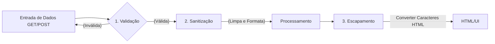

---

#### **A ferramenta principal: `htmlspecialchars()`**

É o principal mecanismo do PHP para neutralizar XSS na camada de apresentação(UI)

**Como a conversão de entidades HTML funciona**

| Caractere Original | Entidade HTML Gerada | Efeito no Navegador |
| :---: | :---: | :--- |
| `<` | `&lt;` (*Less Than*) | O navegador exibe `<` na tela, mas **não cria uma tag**. |
| `>` | `&gt;` (*Greater Than*) | O navegador exibe `>` na tela sem fechar tags. |
| `"` | `&quot;` (*Quotation Mark*) | Não quebra atributos HTML `<input value="...">`. |
| `'` | `&#039;` ou `&apos;` | Protege strings envoltas em aspas simples. |
| `&` | `&amp;` (*Ampersand*) | Evita interpretação incorreta de entidades. |


**A sintaxe no PHP**

```php
string htmlspecialchars (
    string $string
    int $flags = ENT_QUOTES | ENT_SUBSTITUTE | ENT_HTML5,
    ?string $encoding = "UTF-8"
)
```
- `ENT_QUOTES`: Converte tanto aspas duplas quanto aspas simples
- `ENT_SUBSTITUTE`: Substitui sequências de bytes inválidos por caracteres de substituição Unicode em vez de retornar com uma string vazia
- `ENT_HTML5`: Aplica a tabela de entidade compatíveis com a especificação HTML5
- `UTF-8`: Garante que caracteres de lingua portuguesa como "ç", "ã", "é" sejam preservadas sem corrupção.

**A função helper de escapamento**

Para não digitar essa linha extensa em todas as partes de saída de texto para HTML, os desenvolvedores profissionais criam uma função auxiliar curta:

```php
function e(string $texto): string {
    return htmlspecialchars($texto, ENT_QUOTES | ENT_SUBSTITUTE | ENT_HTML5, "UTF-8");
}

<p>Comentário: <?= e($comentarioUsuario) ?></p>
<input type="text" name="nome" value="<?= e($nomeUsuario)> ?>" />
```

#### **Validação e Sanitização com `filter_var()`**

O PHP possui a biblioteca de filtros nativos `filter_var()`.

```php
<?php
declare(strict_types=1);

// 1. Validação de E-mail
$email = "usuario.teste@senai.br";
if (filter_var($email, FILTER_VALIDATE_EMAIL) !== false) {
    // E-mail válido
}

// 2. Validação de Número Inteiro com Limites (Range)
$idade = "25";
$opcoesIdade = [
    'options' => [
        'min_range' => 16,
        'max_range' => 120
    ]
];
if (filter_var($idade, FILTER_VALIDATE_INT, $opcoesIdade) !== false) {
    // Idade é um inteiro entre 16 e 120
}

// 3. Validação de URLs (Links)
$website = "https://www.sp.senai.br";
if (filter_var($website, FILTER_VALIDATE_URL) !== false) {
    // URL possui protocolo e formato válidos
}

// 4. Validação de Endereço IP
$ip = "192.168.1.100";
if (filter_var($ip, FILTER_VALIDATE_IP) !== false) {
    // IP válido
}

```

---

### Semana 8 - Persistência de dados com banco de dados relacional (PostgreSQL) e conexão PDO

**Tema:** Camada de acesso a dados, Driver PDO (PHP Data Objects), Driver `pdo_pgsql`, padrão Singleton, isolamento de credenciais (.env) e tratamento de exceções (PDOException). 

#### **1. Da memória volátil ao Banco de Dados**

Em sistemas corporativos de grande porte, arquivos planos(.txt .json) não oferecem a segurança, integridade, concorrência e velocidade necesárias para armazenamento de dados. Então é aqui que o **BackEnd encontra o Banco de Dados Relacional**.

Banco de dados relacional permitem:

- Conectar a lógica de programação server-side ao Sistema de Gerenciamento de Banco de Dados (SGBD)
- Garantir persistência definitiva e segura dos registros
- Aplicar integridade referencial, constraints, consultas otimizadas e propriedade ACID aprendidas na disciplina de Banco de Dados

> Obs: Atomicidade, assegura que cada transação seja única. Consistência, respeite todas as regras, restrições e chaves definidas, garantindo a validade da transação. Isolamento, transações de forma independente. Durabilidade, transações são confirmadas, garantindo a persistência permantente.

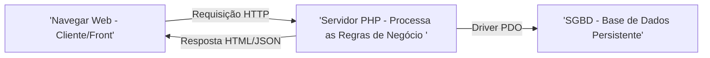

#### **2. O que é o PDO (PHP Data Objects)?**

O **PDO** é uma camada de abstração de acesso a dados integrada nativamente ao PHP. Ele fornece uma interface uniforme e orientada a objetos para se comunicar com múltiplos sistemas de banco de dados (PostgreSQL, MySQL, SQLite, OracleSQL, SQLServer).

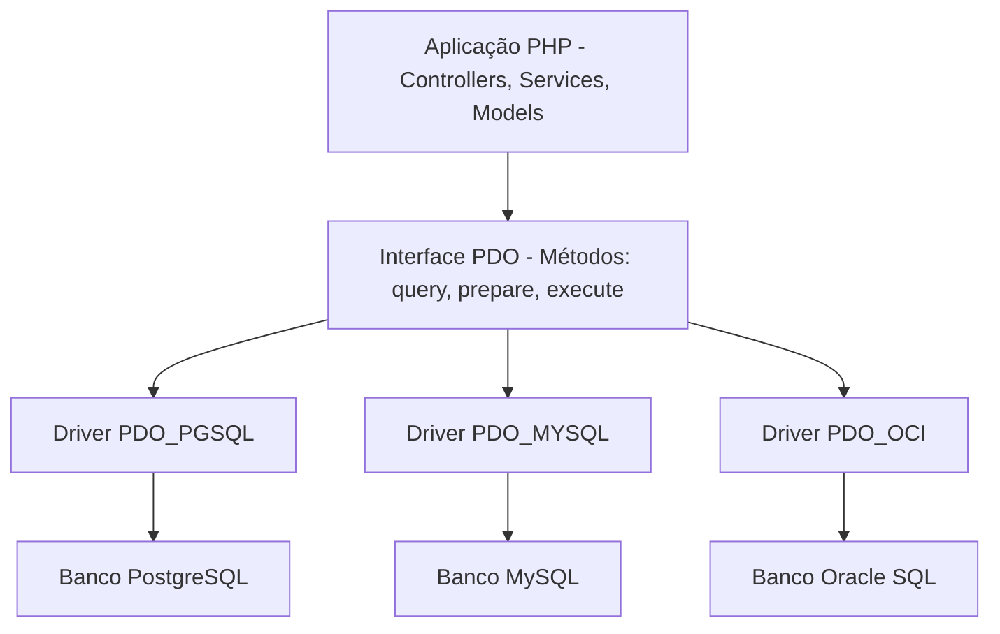

#### **3. Vantagens do uso do PDO**

- **Portabilidade de código**: Os metódos de conexão, consulta e transações são idênticos, independente do banco utilizado. Se o cliente migrar do banco PostgreSQL para outro SGBD, o programador apenas altera a string DSN de conexão, preservando toda a lógica de acesso já criada.
- **Suporte Nativo a Prepared Statements**: O PDO foi projetado para trabalhar com consultas nativas, oferecendo a defesa contra ataques de **SQL Injection** 
- **Tratamento orientado a objetos com Exceptions**: Em vez de retornar códigos de erros, o PDO lança uma instancia da classe especializada `PDOException`

**A sintaxe de conexão PDO: DSN (Data Source Name)**

Para que o PDO saiba onde o banco está localizado, em qual porta abrir, utilizamos a string padronizada **DSN**

```text
pgsql:host=127.0.0.1;port=5432;dbname=seu_banco
  |         |             |           |
  |         |             |           └─ Nome da base de dados relacional (nome do banco)
  |         |             └─ Porta padrão do Banco de Dados PostgreSQL(5432)
  |         └─ Endereço IP ou hostname do servidor
  └─ Identificador do driver do SGBD (pgsql) - PostgreSQL
```

#### **4. A configuração do PDO**

Ao instanciar um objeto PDO, devemos configurar quatro flags essenciais que determinam como o driver se comportará frente a erros e consultas

```php
$opções = [
    // Flag 1: Lança exceções imediatamente quando ocorrer qualquer erro SQL
    PDO::ATTR_ERRORMODE => PDO::ERRORMODE_EXCEPTION,

    // Flag 2: Retorna registros apenas com nomes das colunas (Eliminar duplicidade numérica)
    PDO::ATTR_DEFAULT_FETCH_MODE => PDO::FETCH_ASSOC,

    // Flag 3: Desativa emulação e utiliza prepared statements nativos
    PDO::ATTR_EMULATE_PREPARES => false,

    // Flag 4: Limita a 5 segundos para tentar a conexão com o servidor do BD
    PDO::ATTR_TIMEOUT => 5
]
```

**Detalhamento das Flags**:
- PDO::ATTR_ERRMODE => PDO::ERRMODE_EXCEPTION: por padrão o PDO pode falhar silenciosamente e retorna apenas `false`. Ao ativar o ERR_MODE força o PHP a disparar uma `PDOException`, permitindo que o nosso código interprete qualquer erro em um bloco `try-catch`.
- PDO::ATTR_DEFAULT_FETCH_MODE => PDO::FETCH_ASSOC: por padrão o método `fetch()` retorna um array duplicado contendo índices númericos `[0,1]` e associativos `["id", "código_maquina"]`. Definir o `FETCH_ASSOC` reduz o consumo de memória RAM pela metade e entrega coleções limpas.
- PDO::ATTREMULATE_PREPARES => false: garante que o PHP envie a consulta e os paramêtros separados diretamente para o planejador do BD, processar, blindando a aplicação contra ataques sofisticados de `SQL_injection`

---

#### **5. Proteção de Credenciais**

Um dos erros mais graves cometidos por desenvolvedores iniciantes é escrever dados de conexão diretamente dentro do código:

```php
// Péssima prática de código
$pdo = new PDO("pgsql:host=localhost;dbname=producao", "postgres", "senha123456");
```

Se esse arquivo for versionado e enviado para o GitHub:
1. Suas senhas de produção ficam públicas
2. Robôs maliciosos varrem repositórios à procura de credenciais expostas para invadir banco de dados e sequestrar informações (ataques de Ransomware)
3. A empresa é penalizada por violação da **LGPD (Lei Geral de Proteção de dados)**

**A abordagem segura: Usando arquivos de configuração isolados (`.ini` ou `.env`)**

Isolamos as credenciais em um arquivo externo protegido que **nunca entra no Git**:

```ini
; config/database.ini
[database]
db_driver = pgsql
db_host = 127.0.0.1
db_port = 5432
db_name = producao
db_user = postgres
db_pass = senha12345
```

No arquivo `.gitignore` do projeto:

```text
config/database.ini
.env
logs/*.log
```

---

#### **6. Padrão Singleton de conexão**

Imagine uma aplicação web com 500 usuários acessando simultaneamente.
Se cada script, função executar `new PDO()` sempre que precisar consultar o banco, teremos milhares de conexões de redes abetas desnecessariamente.

No SGBD (PostgreSQL), cada conexão aberta cria um processo no sistema operacional dedicado. Abrir conexões repetidas esgota rapidamente o limite configurado(`max_connection`) do BD gerando erro:
`Fatal Error: sorry, too many clients already`

**Como o Singleton resolve isso**

O padrão **Singleton** garante que **apenas uma única instancia de conexão PDO exista por requisição**, reutilizando-a em qualquer ponto do sistema.

**As configurações do Singleton**:
1. **Construtor Privado** (`private function _constructor`): Impede que outros arquivos instanciem uma nova conexão.
2. **Propriedades Estáticas Privadas** (`private static ?PDO $instancia = null`): Armazena a conexão aberta.
3. **Método de Acesso Estático Público** (`public static function obterConexão():PDO`): A conexão é criada pelo método, se já existir uma conexão apenas devolve a conexão já existente, sem a necessidade de criar uma nova.
4. **Bloqueio de Clonagem e Desserialização** (`_clone` e `_wakeup`): Garante que ninguém consiga duplicar o objeto de conexão

---

#### **7. Tratamento de falhas com `PDOException`**

Quando uma tentativa de conexão falha (servidor desligado, senha incorreta, porta inacessível), o PDO lança uma Exceção(`PDOException`). Então devemos tratar esse erro.

**Práticas recomendadas de Segurança** (AppSec):

**Para o Usuário**: Exibir mensagens amigáveis e genéricas: *Não foi possível processar sua solicitação. Tente novamente mais tarde*
**Para a Equipe de Desenvolvimento**: Gravar os detalhes técnicos completos com timestamp em um arquivo de log seguro (`logs/database.log`).

