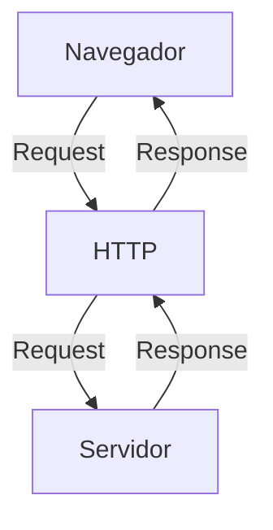

# Curso BackEnd - 1º Semestre - 105h

Prof. Diogo Barbosa

Escola SENAI Americana 

2º Semestre 2026

## Objetivos do curso

- Desenvolver aplicações web Server Side, utilizando a linguagem PHP.
- Aplicar Sintaxe nativa PHP Vanilla;
- Manipulação HTTP;
- Persistência de Dados (Armazenamento em BCD);
- Segurança contra SQL Injection/CSRF;
- Refatoração em POO (Programação Orientada Objetos);
- Arquitetura MVC;
- Utilização do Framework Laravel;

## Cronograma do Semestre 

Carga Horária: 105h

Duração: 20 Semanas

### Semana 1: Introdução ao BackEnd e Configuração do Ambiente PHP

#### O que é BackEnd?

O back-end é a parte de um site ou aplicativo que o usuário não vê, mas que faz tudo funcionar por trás das telas.

- Guarda e organiza informações em um banco de dados;
- Confere se o login e senha estão corretos;
- Calcula valores, como frete ou o total de uma compra;
- Garante que os dados de um usuário não apareçam para outro;
- Faz o sistema suportar muitas pessoas usando ao mesmo tempo, sem travar;

As principais linguagens utilizadas no desenvolvimento back-end são PHP, JavaScript/TypeScript, Python, Java, Kotlin, Go (Golang), C# e Rust.

O backend é o "cérebro" oculto de um site ou aplicativo. Ele roda em um servidor e cuida de tudo o que o usuário não vê na tela.

**As 3 partes básicas de todo backend:**

1. Servidor: o "computador" que fica ligado esperando pedidos (requisições);
2. Banco de dados: onde as informações ficam guardadas (usuários, produtos, mensagens, etc. );
3. Lógica de negócio: as regras do sistema (ex: não deixa comprar se não tiver estoque).

**O Mercado de Trabalho em Back-End:**

O desenvolvimento Back-End é uma das áreas mais cruciais da Tecnologia da Informação.

- Com a transformação digital acelerada, empresas de todos os portes e setores dependem de infraestruturas sólidas e seguras.

- Setores de Atuação: Bancos, hospitais, e-commerces, logística, indústrias, startups e órgãos públicos utilizam Back-End para suportar suas operações críticas.

- Fatores de Crescimento: O avanço da computação em nuvem, aplicativos móveis, Big Data e IA impulsiona continuamente a busca por profissionais da área.

- Modelos de Trabalho: Alta flexibilidade com vagas presenciais, híbridas e remotas (inclusive com oportunidades internacionais).

#### Ciclo de vida da Requisição HTTP

##### O que é HTTP

**HTTP**, ou seja Hypertext Transfer Protocol, é um protocolo de comunicação utilizado para transferência de informações na WWW (World Wide Web) e em outros sistemas de redes.

O HTTP é a base pra que o cliente e um servidor Web troquem informações. Ele permite a requisição e a resposta de recursos, como imagens, arquivos e as próprias páginas web, por meio de mensagens padrão (protocolo).

##### Como Funciona o HTTP

1. O cliente estabelece contato com o servidor, estabelecendo uma requisição HTTP;
2. Nessa requisição o cliente especifica o método pretendido (read-GET, create-POST, update-PUT/PATCH, delete-DELETE).
3. O servidor processa e responde com uma mensagem HTTP, com os recursos solicitados;

### Como funciona na prática o BackEnd

- **Ação do usuário**: Envia uma solicitação pela UI (Interface do Usuário).
Exemplo de UI: Tela do celular, Navegador de Internet, Alexa ...
- **Envio da requisição**: A UI transforma a ação do usuário em uma requisição HTTP
- **O processamento BackEnd**: o código BackEnd recebe o pedido, valida os dados e decide o que fazer (Ex: consulta uma informação no banco de dados)
- **Resposta**: O servidor devolve o resultado para a UI (Ex: um login autorizado, uma compra confirmada, ...)

#### Tipos de requisição HTTP

Os tipos de requisição HTTP indicam a ação que o usuário deseja executar no servidor. As principais ações são:

- **GET**: Pede dados de um lugar especifico. "Não faz alterações no servidor"
- **POST**: Envia dados novos para **criar** algo ou processar informações.
- **PUT/PATCH**: Modifica dados já existentes. **PUT** -> Atualização total dos dados. **PATCH** -> Atualização parcial dos dados.
- **DELETE**: Apaga um dado do servidor.
---

#### Iniciando o PHP

##### O que é PHP

**PHP** (Hypertext PreProcessor) é uma linguagem de programação interpretada e open source, focada no desenvolvimento de sistemas para web, pode ser usada junto com o HTML para criação de páginas web dinâmicas.

##### Instalando o PHP

- Fazer o download do PHP (php.net);
- ZIP - Non Thread Safe 8.5
- Descompactar o arquivo do PHP na pasta C:\src\php (Para descompactar, usar o 7Zip = Melhor) -> nunca salvar arquivos na raiz do sistena (C:)
- Modificar o arquivo php.ini-development para -> php.ini (cria as configurações do PHP na máquina) - adicionar ou remover funcionalidade do PHP
- Adicionar a pasta do PHP (C:\src\php) as variáveis de ambiente do sistema (PATH) 
- Verificar a instalação rodando o comando php --version

##### Contextualizando o PHP

O PHP de fato é uma das linguagens de programação mais populares da atualidade. Ela permite que você crie aplicações web robustas, de uma maneira muito simplificada e direto ao ponto. Sem contar que a linguagem traz diversos recursos que facilitam e aceleram o processo de desenvolvimento de sites e sistemas para web. E além do mais, ela ainda tem um ótimo ecossistema, uma excelente comunidade e um grande mercado de trabalho.

##### Criando minha primeira aplicação em PHP

Criando um Hello, World!!!

##### Criando o perfil de PHPVanilla

-> Profile -> New profile
-> Extensions:
- PHP InteliPhense (A do Elefantinho): AutoCompletar (Snipets)
- PHP Debug (Xdebug): Acha erros em linha de código
- PHP CS FIXER: Formatação padrão do código (Identação)
- PHP Server: Sobe um servidor local para acompanhamento em tempo real